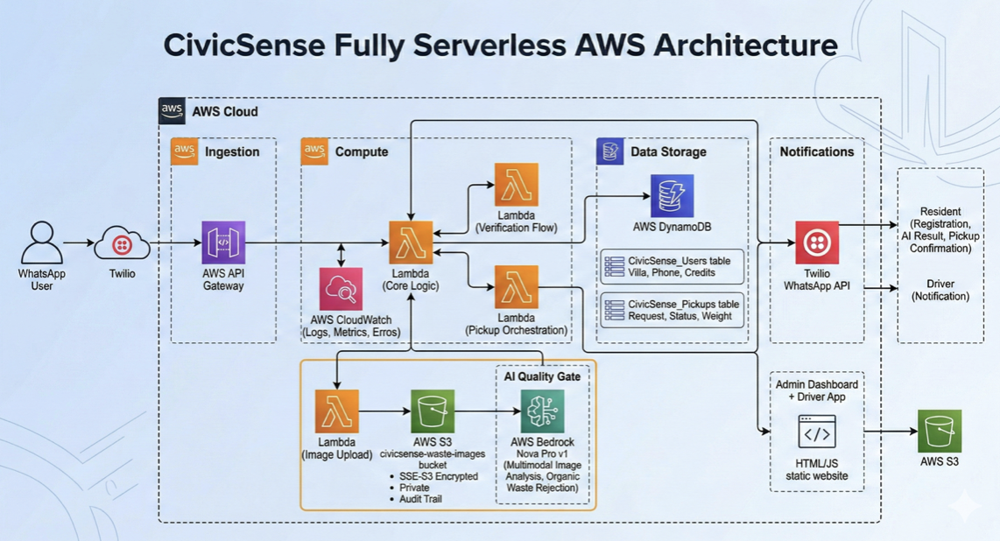
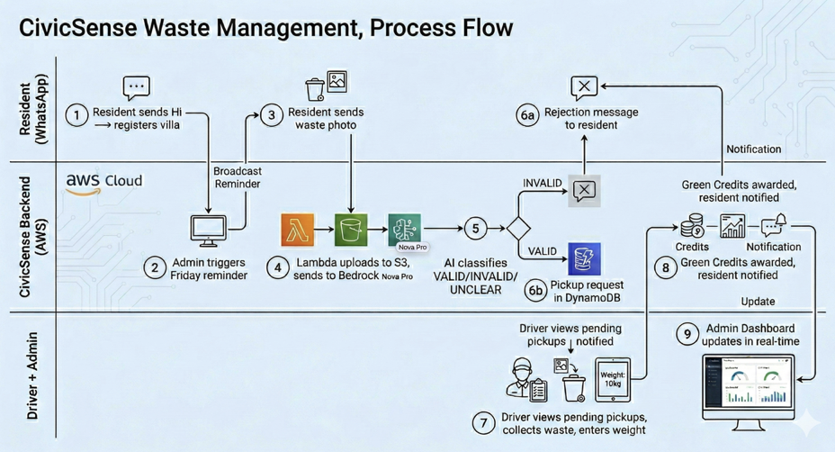
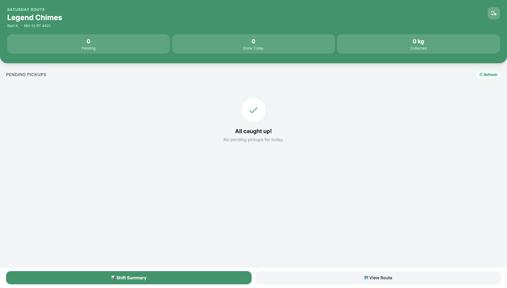
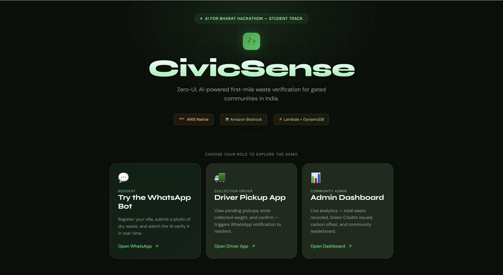
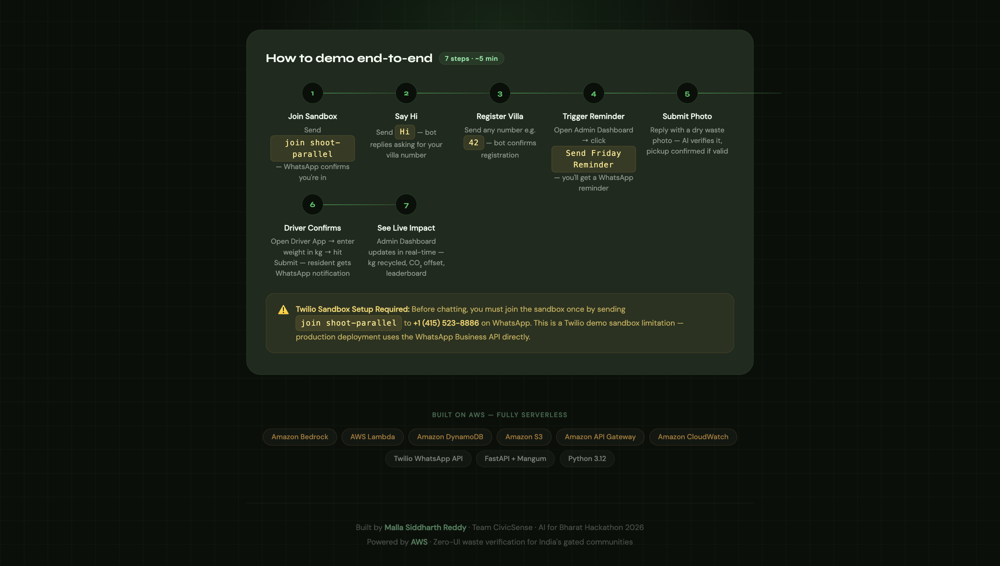

# CivicSense — AI for Bharat

**Zero-UI, AI-powered first-mile waste verification for gated communities in India.**

[](https://aws.amazon.com)
[](https://aws.amazon.com/bedrock)
[](https://aws.amazon.com/lambda)
[](https://aws.amazon.com/dynamodb)
[](https://wa.me/14155238886)

---

## 🔗 Live Demo

### 👉 [http://civicsense-demo.s3-website-us-east-1.amazonaws.com](http://civicsense-demo.s3-website-us-east-1.amazonaws.com)

| Role | Link |
|------|------|
| 💬 Resident (WhatsApp Bot) | [Try the bot](https://wa.me/14155238886?text=join+shoot-parallel) |
| 🚛 Driver Pickup App | [Open Driver App](http://civicsense-demo.s3-website-us-east-1.amazonaws.com/driver.html) |
| 📊 Admin Dashboard | [Open Dashboard](http://civicsense-demo.s3-website-us-east-1.amazonaws.com/dashboard.html) |

---

## 🧠 The Problem

In gated communities across India, poor source-level waste segregation leads to contaminated recycling streams and inefficient collections — because there is no simple, verifiable way to validate segregation quality at the point of disposal, before pickup.

---

## 💡 The Solution

CivicSense is a **Zero-UI waste verification system** — residents send a photo of their dry waste on WhatsApp. Amazon Bedrock (Nova Pro) analyses the image in real-time as a strict quality gate. Only properly segregated dry waste triggers a pickup. No app download. No forms. Just WhatsApp.

The AI doesn't classify after collection — it **prevents contaminated waste from being collected in the first place.**

---

## 🏗️ AWS Architecture



| Component | Service |
|-----------|---------|
| Messaging interface | WhatsApp Business API via Twilio |
| Ingestion | Amazon API Gateway (HTTP API v2) |
| Core compute | AWS Lambda (Python 3.12, arm64, 30s timeout) |
| AI quality gate | Amazon Bedrock — Nova Pro v1 (multimodal) |
| Database | Amazon DynamoDB — `CivicSense_Users` + `CivicSense_Pickups` |
| Image storage | Amazon S3 — `civicsense-waste-images` (SSE-S3 encrypted, private) |
| Frontend hosting | Amazon S3 static website |
| Observability | Amazon CloudWatch |
| Framework | FastAPI + Mangum (ASGI adapter) |

---

## ⚡ End-to-End Process Flow



1. Resident sends `Hi` → Bot asks for Villa Number → Registration stored in DynamoDB
2. Admin triggers Friday reminder broadcast from Admin Dashboard
3. Resident sends a photo of dry waste via WhatsApp
4. Lambda uploads image to S3 → sends to Bedrock Nova Pro for analysis
5. Nova Pro classifies: **VALID / INVALID / UNCLEAR**
6. **VALID** → Pickup request created in DynamoDB, slot confirmed via WhatsApp
7. **INVALID** → Bilingual (English + Hindi) rejection with specific guidance
8. Driver views pending pickups in Driver App → enters weight → confirms
9. Green Credits awarded (10 pts/kg) → resident notified via WhatsApp
10. Admin Dashboard updates in real-time — kg recycled, CO₂ offset, leaderboard

---

## 📱 Prototype Screenshots

### Admin Dashboard


### Driver App


### Live Demo Launchpad



---

## ✨ Key Features

- **Zero-UI onboarding** — register via WhatsApp, no app required
- **AI segregation gate** — Bedrock Nova Pro rejects wet/organic waste with zero tolerance; even 1 fruit in frame = INVALID
- **Bilingual support** — English + Hindi (Devanagari script) responses throughout
- **Conditional pickup** — no AI approval = no pickup request created
- **Green Credits** — 10 points per kg collected, with community leaderboard
- **Driver App** — mobile-friendly pickup confirmation with weight capture
- **Admin Dashboard** — live analytics, CO₂ offset, Friday reminder broadcast
- **Permanent audit trail** — all waste photos stored in S3

---

## 🚀 Local Development

### Prerequisites
- Python 3.12
- AWS account with Bedrock Nova Pro access enabled (us-east-1)
- Twilio account with WhatsApp Sandbox

### Setup

```bash
git clone https://github.com/mallasiddharthreddy/CivicSense-AI-for-Bharat.git
cd CivicSense-AI-for-Bharat
pip install fastapi mangum boto3 twilio requests python-dotenv uvicorn
```

Create a `.env` file:
```env
TWILIO_SID=your_twilio_sid
TWILIO_TOKEN=your_twilio_token
TWILIO_NUMBER=whatsapp:+14155238886
REGION=us-east-1
S3_BUCKET=civicsense-waste-images
COMMUNITY_ID=Legend_Chimes
```

Run locally:
```bash
uvicorn main:app --reload --port 8000
```

Use [ngrok](https://ngrok.com) to expose your local server and set the ngrok URL as your Twilio webhook.

### Deploy to Lambda

```bash
zip -r deployment.zip . -x "*.git*" -x "venv/*" -x "__pycache__/*" -x "*.pyc" -x "templates/*"
```

Upload `deployment.zip` to AWS Lambda. Set handler to `main.handler`.

---

## 📁 Project Structure

```
CivicSense-AI-for-Bharat/
├── main.py                     # Core Lambda handler — bot logic, AI verification, pickup flow
├── templates/
│   ├── index.html              # Demo launchpad — single submission URL
│   ├── dashboard.html          # Admin analytics dashboard
│   └── driver.html             # Driver pickup confirmation app
├── Diagrams/
│   ├── AWS_Architecture_Diagram.png
│   ├── User_Flow_Diagram.png
│   ├── Admin-Dashboard_picture.png
│   ├── driver-dashboard_picture.png
│   ├── Final_Link-Dashboard-1.png
│   └── Final_Link-Dashboard-2.png
├── design.md                   # Full system design document
├── requirements.md             # Functional requirements document
├── .gitignore
└── README.md
```

---

## 👨‍💻 Team

**Malla Siddharth Reddy** — Team CivicSense
AI for Bharat Hackathon 2026 — Student Track

---

*Built entirely on AWS. Zero always-on infrastructure. Pay-per-use AI. Built for Bharat.*
