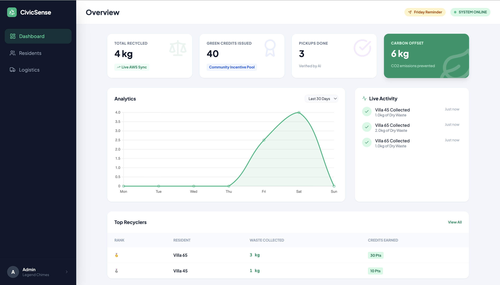

# Requirements Document

## Introduction

CivicSense is a Zero-UI, AI-powered first-mile waste verification and logistics coordination system designed for gated communities in India. The system operates as an intelligent gatekeeper that verifies dry waste segregation quality BEFORE triggering pickup logistics, ensuring clean recycling supply chains and community-wide behavioral change.

Unlike traditional waste classification tools, CivicSense coordinates the complete civic workflow: community participants submit waste images via WhatsApp → Amazon Bedrock verifies segregation quality → eligible waste triggers pickup requests → drivers collect verified waste → participants earn credits → community impact is tracked on an AWS dashboard. The AI acts as a critical quality control checkpoint, rejecting mixed or wet waste to maintain recycling stream integrity.

By leveraging familiar WhatsApp technology and requiring no app installation, CivicSense achieves maximum community accessibility while driving measurable improvements in source segregation compliance and first-mile recycling efficiency.

## Glossary

* **CivicSense_System:** The complete first-mile waste verification and logistics coordination system including WhatsApp integration, AI gatekeeper, pickup coordination, and community impact tracking.
* **WhatsApp_Interface:** The conversational interface through WhatsApp that handles community participant interactions and image submissions.
* **AI_Gatekeeper:** The Amazon Bedrock (Nova Pro) machine learning system that verifies waste segregation quality and determines pickup eligibility.
* **Driver_Interface:** Web-based static interface for waste collection drivers to view verified pickup requests and record collected waste weights.
* **Pickup_Request:** Automatically generated collection request triggered in DynamoDB only when AI verifies waste meets segregation standards.
* **Green_Credits:** Point-based rewards allocated to community participants based on verified waste weight.
* **Community_Admin:** Designated person responsible for managing community-level settings and viewing analytics.
* **Community_Participant:** Individual living in a gated community who submits waste for AI verification.
* **Dry_Waste:** Non-biodegradable waste items including plastics, paper, metal, and glass.
* **Community_Dashboard:** Web interface displaying environmental impact metrics, leaderboards, and aggregated waste management analytics.

## Requirements

### Requirement 1: Zero-UI WhatsApp Interaction

**User Story:** As a community participant in a gated community, I want to interact with the waste verification system exclusively through WhatsApp, so that I can participate in proper waste management without installing apps or learning new interfaces.

**Acceptance Criteria:**
* WHEN a community participant sends their Villa Number to the CivicSense WhatsApp number, THE system SHALL register them in DynamoDB and respond with a welcome message.
* WHEN a community participant sends an image of dry waste, THE WhatsApp_Interface SHALL acknowledge receipt and initiate AI verification.
* WHEN the AI verification is complete, THE WhatsApp_Interface SHALL send back eligibility results and pickup confirmation or rejection reasons.
* WHEN a community participant sends "help", THE WhatsApp_Interface SHALL provide concise usage instructions and waste category guidelines.
* THE WhatsApp_Interface SHALL support full bilingual communication in English and standard Devanagari Hindi for maximum community accessibility in Bharat.
* WHEN interacting with the system, community participants SHALL complete the entire verification process in <= 2 user actions (send image + optional clarification).

### Requirement 2: AI-Gated Waste Verification and Pickup Eligibility

**User Story:** As a community participant, I want the AI system to verify my waste segregation quality and automatically trigger pickup requests only for properly segregated waste, so that I contribute to clean recycling streams.

**Acceptance Criteria:**
* WHEN an image of dry waste is submitted, THE system SHALL upload the image to Amazon S3 and invoke Amazon Bedrock (Nova Pro) for analysis within 30 seconds.
* THE AI_Gatekeeper SHALL act as a "conservative inspector," approving ONLY images exclusively containing clean dry recyclables (plastics, paper, metal, glass).
* WHEN approved, THE system SHALL automatically generate a `PENDING` Pickup_Request for the driver interface, preventing contamination of public recycling streams.
* WHEN organic matter, fruits, vegetables, wet waste, or contaminated items are detected, THE AI_Gatekeeper SHALL reject the submission and return an `INVALID` status.
* WHEN closed black bags or blurry photos are detected, THE AI_Gatekeeper SHALL return an `UNCLEAR` status.
* WHEN waste is rejected or unclear, THE system SHALL provide specific, context-aware bilingual corrective guidance to support community learning.

### Requirement 3: Logistics Orchestration and Driver Interface

**User Story:** As a waste collection driver, I want to access a prioritized list of verified pickup requests with community participant details, so that I can efficiently collect only properly segregated waste and record accurate data.

**Acceptance Criteria:**
* WHEN the AI_Gatekeeper approves waste submissions, THE CivicSense_System SHALL automatically create `PENDING` records in the DynamoDB Pickups table.
* WHEN accessing the web-based Driver_Interface, drivers SHALL see a prioritized list of verified pickups with community participant villa numbers and request IDs.
* WHEN arriving at a pickup location, THE Driver_Interface SHALL allow drivers to enter the exact weight collected in kilograms using a simple numeric input form.
* WHEN waste weight is submitted, THE system SHALL update the pickup status to `COMPLETED` in the database.
* WHEN pickup is completed, THE system SHALL trigger an automatic notification to the community participant via WhatsApp confirming the collection weight and total credits earned.

### Requirement 4: Gamification and Community Impact Tracking

**User Story:** As a community participant, I want to earn credits for properly segregated waste and see my community's collective environmental impact, so that I stay motivated to maintain good segregation practices.

**Acceptance Criteria:**
* WHEN verified waste is collected and weight is input by the driver, THE CivicSense_System SHALL allocate Green_Credits to community participants (10 credits per 1 kg of verified dry waste).
* WHEN viewing the Community_Dashboard, admins and participants SHALL see a community leaderboard displaying top contributors by credits earned.
* THE Community_Dashboard SHALL calculate and display live environmental impact metrics, including total waste diverted (kg) and estimated CO2 offset (calculated at 1.5kg CO2 per 1kg of waste).
* THE Community_Dashboard SHALL provide a "Friday Reminder" trigger button that allows admins to blast automated WhatsApp reminders to all registered users simultaneously to orchestrate weekend pickups.

### Requirement 5: Minimal Friction and Behavioral Change

**User Story:** As a busy community participant, I want the waste verification process to be effortless and educational, so that I can easily maintain proper segregation habits without disrupting my daily routine.

**Acceptance Criteria:**
* WHEN a community participant sends a waste image, THE CivicSense_System SHALL handle the AWS Lambda invocation and Bedrock processing within a 30-second window.
* THE WhatsApp_Interface SHALL provide bilingual guidance that directly addresses what is accepted vs. not accepted rather than generic educational content.
* THE system SHALL allow users to instantly check their current Green Credits score and rank by typing "status" or "rank".

### Requirement 6: Privacy and Data Security

**User Story:** As a community participant, I want my personal information to remain private while contributing to community-level impact tracking.

**Acceptance Criteria:**
* WHEN community participants interact with the system, THE CivicSense_System SHALL collect only the minimal data necessary (Phone Number, Villa Number, Credits).
* ALL submitted waste images SHALL be permanently and securely stored in an Amazon S3 bucket (`civicsense-waste-images`) for verification and dispute resolution.
* WHEN displaying community analytics, THE Community_Dashboard SHALL mask personal phone numbers and display only Villa identifiers to protect individual privacy.

### Requirement 7: System Reliability and Performance

**User Story:** As a community admin, I want the system to handle concurrent users and maintain consistent performance, so that all community participants can access reliable waste verification.

**Acceptance Criteria:**
* THE core backend (AWS Lambda) SHALL be explicitly configured with a 30-second execution timeout to accommodate the processing time required for complex multimodal AI reasoning.
* THE CivicSense_System SHALL store all interaction data, pickup records, and credit transactions securely using Amazon DynamoDB to ensure high availability and fast read/write speeds.

### Requirement 8: Integration and Deployment

**User Story:** As a system administrator, I want to deploy and maintain the CivicSense system using cloud infrastructure, so that the system leverages AWS native services for the hackathon evaluation.

**Acceptance Criteria:**
* THE backend SHALL be built using FastAPI and adapted for AWS Lambda deployment using the Mangum library.
* THE CivicSense_System SHALL route external web traffic through an Amazon API Gateway configured with a Greedy Proxy (`/{proxy+}`) route.
* THE AI_Gatekeeper SHALL utilize Amazon Bedrock (Nova Pro) for all image recognition and reasoning capabilities.
* THE Community_Dashboard and Driver_Interface SHALL be deployed as static HTML/JS assets hosted on Amazon S3.
* THE CivicSense_System SHALL integrate with Twilio's WhatsApp Business API Sandbox for seamless message and media ingestion.
